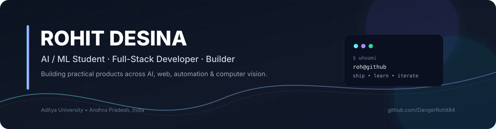

  
  
  

  <strong>I build software that moves from idea → prototype → product.</strong> 
  AI applications · Full-stack systems · Developer tools · Student-focused products · Computer vision

  <a href="https://github.com/DangerRohit84">GitHub</a> ·
  <a href="https://www.linkedin.com/in/rohit-desina">LinkedIn</a> ·
  <a href="mailto:desinarohit2007@gmail.com">Email</a>

---

## 👋 About

I'm **Rohit Desina**, an **Artificial Intelligence & Machine Learning** student at **Aditya University** in Andhra Pradesh, India.

I like working at the intersection of **AI and practical software engineering**. Most of my projects start with a real problem, then grow through rapid prototyping, API design, data modeling, UI work, testing, and deployment.

I'm especially interested in:

- 🤖 Generative AI, LLM applications & AI agents
- 🌐 Full-stack web development
- 🧠 Computer vision & intelligent interfaces
- 📱 On-device / offline AI
- ⚙️ Automation, developer tooling & system design
- 🏗️ Building products that are actually usable

---

## 🧭 What I'm Building Around

<table>
<tr>
<td width="25%" align="center">
  <h3>🤖 AI</h3>
  LLM apps 
  AI agents 
  Multimodal workflows
</td>
<td width="25%" align="center">
  <h3>🌐 Web</h3>
  React 
  Node.js 
  TypeScript
</td>
<td width="25%" align="center">
  <h3>🧠 ML</h3>
  Computer vision 
  Intelligent systems 
  On-device AI
</td>
<td width="25%" align="center">
  <h3>🏗️ Product</h3>
  Prototyping 
  APIs & databases 
  Deployment
</td>
</tr>
</table>

---

## 🚀 Featured Projects

### 🏫 [CampusFlow](https://github.com/DangerRohit84/CampusFlow)
**A multi-tenant campus operating system**

CampusFlow brings academic workflows, collaboration, career growth, realtime communication and AI-assisted features into one platform.

**Core stack:** <code>React</code> <code>Vite</code> <code>TypeScript</code> <code>Tailwind</code> <code>Node.js</code> <code>Express</code> <code>Prisma</code> <code>PostgreSQL</code> <code>Socket.IO</code>

---

### 🌾 [KisaanMitra](https://github.com/DangerRohit84/KisaanMitra)
**Voice-first agricultural intelligence for farmers**

An AI-assisted agricultural platform combining crop diagnosis, Hindi interaction, weather, mandi information, maps and an SMS fallback workflow.

**Core stack:** <code>React</code> <code>Vite</code> <code>Tailwind</code> <code>Node.js</code> <code>Express</code> <code>Firebase</code> <code>Gemini</code> <code>Genkit</code> <code>Cloud Run</code>

---

### 🏟️ [StadiumIQ](https://github.com/DangerRohit84/StadiumIQ)
**Smart stadium command center + fan assistant**

A simulation-driven platform for crowd intelligence, emergency response, navigation, analytics, multilingual interaction and fan experience.

**Core stack:** <code>Python</code> <code>Flask</code> <code>Socket.IO</code> <code>Gemini</code> <code>SQLite</code> <code>Chart.js</code> <code>Docker</code>

---

### 🪪 [CertiHub](https://github.com/DangerRohit84/CertiHub)
**AI-powered credential intelligence**

Turns certificates into structured, searchable career data using multimodal AI, OCR, skill extraction, institutional workflows and portfolio features.

**Core stack:** <code>React</code> <code>Express</code> <code>Firebase</code> <code>Groq</code> <code>Llama Vision</code> <code>Cloudinary</code>

---

### 🤝 [MeetFlow AI](https://github.com/DangerRohit84/Meetflow)
**Meeting intelligence & follow-up automation**

Transforms meeting transcripts into actionable tasks, decisions, deadlines and assignments with multi-provider AI support.

**Core stack:** <code>Next.js</code> <code>TypeScript</code> <code>Tailwind</code> <code>Prisma</code> <code>PostgreSQL</code> <code>AI APIs</code>

---

### 🧪 [UniHack Product Intelligence](https://github.com/DangerRohit84/unihack-product-intelligence)
**High-volume product data enrichment pipeline**

Transforms a small structured product dataset into a much richer attribute set using category-aware extraction, normalization and validation.

**Core stack:** <code>Python</code> <code>CLI</code> <code>Data Pipelines</code> <code>Schema Validation</code>

---

## 🛠️ Tech I Use

### Languages

  

### Web & Backend

  

### Data, Cloud & DevOps

  

### AI / ML

  
  
  
  
  

---

## 📈 GitHub at a Glance

---

## 🧩 Selected Repositories

| Repository | What it is |
|---|---|
| [**CampusFlow**](https://github.com/DangerRohit84/CampusFlow) | Multi-tenant campus platform |
| [**KisaanMitra**](https://github.com/DangerRohit84/KisaanMitra) | AI agricultural assistant |
| [**StadiumIQ**](https://github.com/DangerRohit84/StadiumIQ) | Smart stadium intelligence |
| [**CertiHub**](https://github.com/DangerRohit84/CertiHub) | AI credential platform |
| [**Meetflow**](https://github.com/DangerRohit84/Meetflow) | Meeting intelligence |
| [**Smart-PDF-Reader**](https://github.com/DangerRohit84/Smart-PDF-Reader) | Intelligent PDF workflow |
| [**OMNIBOT**](https://github.com/DangerRohit84/OMNIBOT) | Agentic knowledge extraction |
| [**Offline-Reels**](https://github.com/DangerRohit84/Offline-Reels) | Offline-first media experiment |
| [**JanSevaAI**](https://github.com/DangerRohit84/JanSevaAI) | AI-focused civic application |
| [**Carbon-Footprint-Awareness-Platform**](https://github.com/DangerRohit84/Carbon-Footprint-Awareness-Platform) | Personal carbon tracking |

---

## 🧠 Currently Exploring

<code>LLM Agents</code> · <code>RAG</code> · <code>Multimodal AI</code> · <code>On-Device AI</code> · <code>Computer Vision</code> · <code>Offline-First Apps</code> · <code>System Design</code> · <code>Developer Experience</code>

> I care about the full loop: understanding the problem, building the system, testing it, shipping it, and improving it.

---

## 🏆 Highlights

| 💻 Build | 🧠 Learn | 🚀 Ship |
|:---:|:---:|:---:|
| Full-stack systems | AI / ML | Hackathon prototypes |
| AI-powered products | Computer vision | Working demos |
| Developer tools | System design | Deployments |

---

## 🌱 Beyond Code

I enjoy participating in **hackathons, innovation programs and student technology communities**, especially when they force me to build under real constraints and communicate an idea clearly.

I also keep experimenting with projects that explore how **AI can work locally, intelligently and practically** instead of only being a chat interface.

---

## 📬 Let's Connect

  
  
  

---

### ⚡ Build boldly. Learn continuously. Ship useful things.

Thanks for stopping by — explore the repositories below and see what I'm building.

